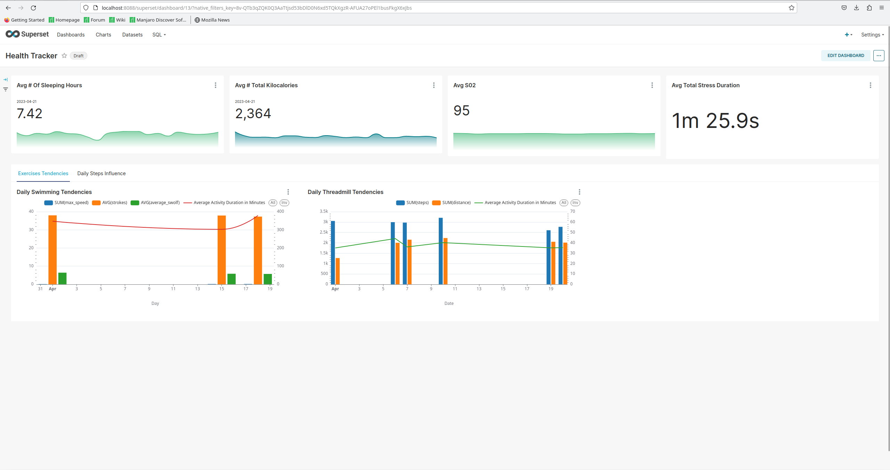
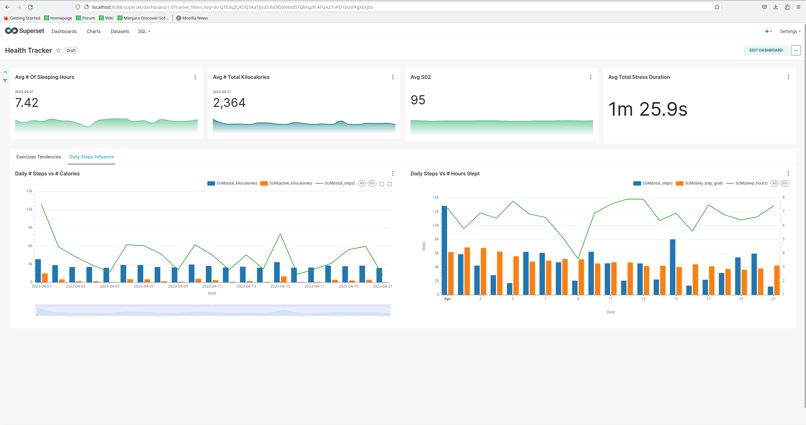
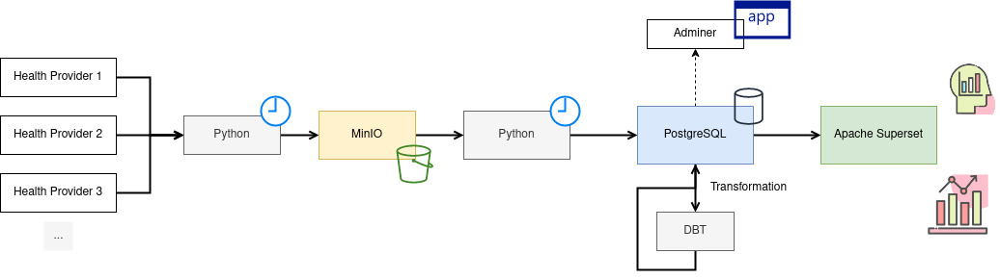
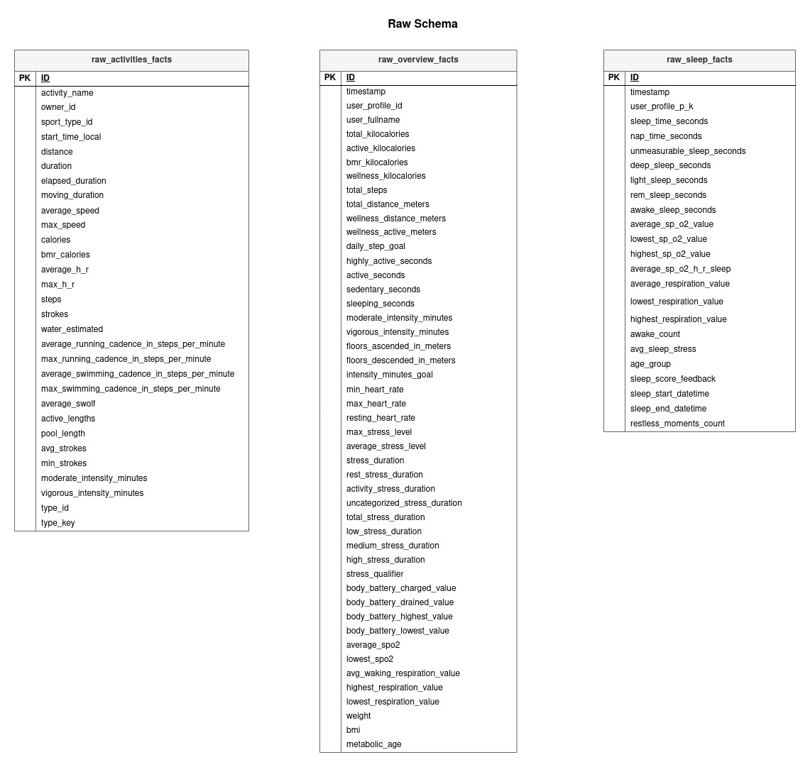
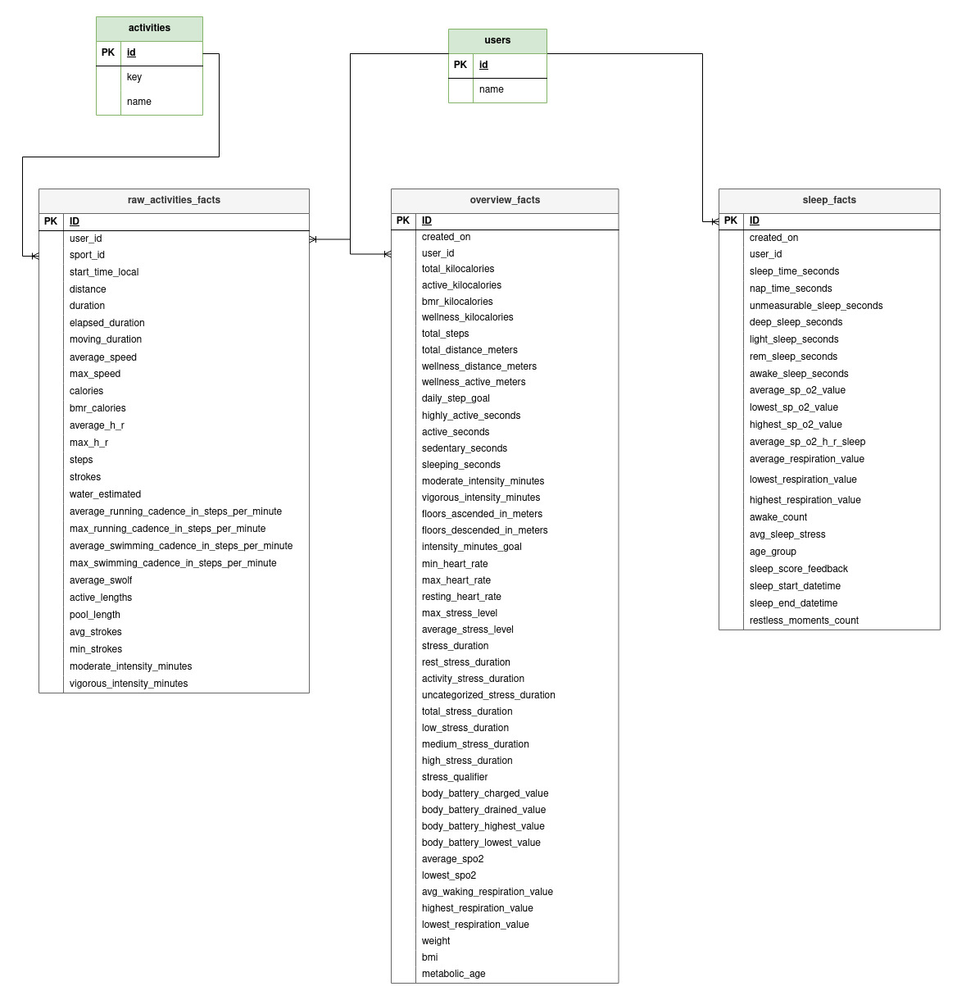

# Health Tracker

Personal project to gather different health metrics across many health providers and have it centralized. The goal of this project is to have a dashboard that can access, compare and analyze this data.

At the moment, the only datasouce that is implemented is Garmin. And no proper orchestration is set up, being handled by cron jobs.

<!-- markdown-toc start - Don't edit this section. Run M-x markdown-toc-refresh-toc -->
**Table of Contents**

- [Health Tracker](#health-tracker)
- [Local set up](#local-set-up)
- [Deliverables](#deliverables)
- [Metrics](#metrics)
- [Dashboard](#dashboard)
- [Technologies](#technologies)
- [Q&A (Behind the Project)](#qa-behind-the-project)
- [Reasons for Technologies](#reasons-for-technologies)
- [Design](#design)
- [Process](#process)
- [DataLake](#datalake)
- [Data Warehouse](#data-warehouse)
- [Reasoning behind the design](#reasoning-behind-the-design)
- [Improvements](#improvements)

<!-- markdown-toc end -->


# Local set up
TBD 

# Deliverables

## Metrics

Some useful metrics that can be answered with this data set:

``` sql
-- Top 5 Hours Slept, ranked by number of Days slept in descending order

SELECT ROUND(sleep_time_seconds * 1.00 / 3600) as sleep_hours,
count(created_on) as days
FROM prod.sleep_facts
group by sleep_hours
order by days desc
limit 5

-- Top 5 Days with most elapsed minutes during an activity
SELECT
DATE_TRUNC('day', start_time_local) as act_day,
ROUND(AVG(elapsed_duration::NUMERIC / 60.00), 2) as minutes_moved
FROM prod.activities_facts 
GROUP BY act_day
ORDER BY minutes_moved desc

-- The Day with the least amount of Swolf when Swimming
SELECT
  DATE_TRUNC('day', start_time_local) as activity_date,
  SUM(average_swolf) as swolf
FROM activities_facts
WHERE activities_facts.sport_id = 5
GROUP BY activity_date
ORDER BY swolf ASC 
LIMIT 1

-- The Day where least amount of calories were burnt during an activity
SELECT
  DATE_TRUNC('day', start_time_local) as activity_date,
  SUM(calories) as calories
FROM activities_facts
GROUP BY activity_date
ORDER BY calories ASC 
LIMIT 1

-- The User with the least amount of stress duration in a week
with weekly_stress as (
SELECT
  user_id,
  DATE_TRUNC('week', created_on) as activity_date,
  SUM(stress_duration) as stress
FROM overview_facts 
GROUP BY user_id,activity_date
ORDER BY stress ASC 
LIMIT 1
)
select u.name
from users as u
JOIN weekly_stress as w ON u.id = w.user_id
```

## Dashboard

Currently, the dashboard is living in Apache Superset. It doesn't have a lot of tiles, but here are some screenshots:





# Technologies

The technologies used are:

- Python (3.11). Programming language of choice.
  - [Garmin Connect](https://pypi.org/project/garminconnect/).
  - [SQLAlchemy](https://docs.sqlalchemy.org/en/20/).
  - [python-dontenv](https://pypi.org/project/python-dotenv/).
- [Minio](https://min.io/) (as DataLake). Used as an S3 replacement.
- [PostgreSQL](https://www.postgresql.org/) (as Data Warehouse). There aren't a lot of FOSS alternatives for a DWH.
  - [Adminer](https://www.adminer.org/). To administer the Data Warehouse through a UI.
- [DBT](https://www.getdbt.com/). For the transformation layer inside the DWH. Code base inside the `transformations` folder.
- [Apache Superset](https://superset.apache.org/). As a BI tool to create dashboard with insights.
- [Docker](Docker) & [Docker Compose](https://docs.docker.com/compose/compose-file). For the deployment of the project.

# Q&A (Behind the Project)

## Reasons for Technologies

These technologies were mainly choosed because they can be easily self hosted. Due to the scope of this project mainly being personal information, I didn't want to use a cloud-based approach. Instead I opted for something that can be easily served inside my homelab.

All of the chosen technologies are FOSS software, and locally hostable through Docker instances. 

## Design

This project uses both an ETL and ELT approach to getting the data into a dashboard.

### Process

The project is meant to gather data around different health providers and aggregate them together into a dashboard. For this reason, the process is divided into two different steps with different technologies. 

First, an ETL step: 

1. Getting data from the health providers.
2. Transforming it to only get the most valuable metrics.
3. Delivering it into a S3 compatible store, to form a DataLake.

For the second phase, it's converted into a ELT step as all the data is ready to be stored into a database. The steps are as follow:

1. Get the data from the DataLake.
2. Load it into a Data Warehouse.
3. Transform the data inside the DWH so it can be analyzed over.

The general process looks as follows:



### DataLake

The design of the DataLake is a rather simple one, following this structure:

``` sh

└── {bucket}
   └── {source}
      ├── {date}
      │  ├── activities.json
      │  ├── overview.json
      │  ├── sleep.json
      │  └── user.json
...
```
For example, this is how it looks like currently:

``` sh

└── health-tracker
   └── garmin
      ├── 2023-03-31
      │  ├── activities.json
      │  ├── overview.json
      │  ├── sleep.json
      │  └── user.json
      ├── 2023-04-01
      │  ├── activities.json
      │  ├── overview.json
      │  ├── sleep.json
      │  └── user.json
      ├── 2023-04-02
      │  ├── activities.json
      │  ├── overview.json
      │  ├── sleep.json
      │  └── user.json
      ├── 2023-04-03
...
```

### Data Warehouse

The Data Warehouse schema is broken down into two different levels:

1. The `raw` schema, were data lands after the ELT stage.
1. The transformations, broken into `bronze` and `prod` schemas. They are generated after DBT's models. It is modeled after a star schema, as the dimensions of the data source are few, and it makes it easier to join with the Facts.

This is a representation of the design:

- Raw design



- Star design



### Reasoning behind the design

No deep reasoning in place. Wanted to learn as much as I could behind Data Engineering, and technologies that are used. Even though the industry is moving more and more towards Cloud tooling, understanding FOSS is important to understand cloud tools.

This scope is over engineered for a local scope project, but wanted to learn and replicate a proper enterprise environment.

Finally, since the approach of this project is an overview of a day to day health metrics, batch processing is more than enough. Streaming isn't considered as most of this data isn't given for free to individual devs, instead to enterprises.

# Improvements

There were some choices made at the beginning phase of this project that can be changed to further improve it. Mostly these design choices were made to set up first a MVP. Now that this initial phase is done, revisiting initial ideas can be fruitful.

Right now the only data source that is being collected is Garmin. This is a point to improve forward, to also enrich the dataset collected.

Another point, proper testing is missing. Both in Python code and in DBT models.

Another point, is to properly set up an orchestration tool,  in order to properly schedule and control both ETL and ELT process. Some tools suited are: 

- [Dagster](https://dagster.io/).
- [Apache Nifi](https://airflow.apache.org/).
- [Airflow](https://nifi.apache.org/).

To properly be deployed in a production environment, most UI components in the project will need to be accessed through a reverse proxy, like Traefik. This is to ensure proper HTTPS handling and add a security layer, as it's mostly personal data.

If power efficiency and data efficiency are valid concerns, the project will need to be scaled down to be only an ETL process: Getting data from sources, transforming with Python, loading into Data Warehouse. This is mostly to remove intermidiate steps and remove data duplication.

If the DataLake is going to be kept, probably set up different environments inside it. Instead of transforming the data before reaching it, saving the raw data as is, then transforming it to ensure information that's needed and finally cleaning it. Also, following this line of thought, most probably converting from JSON format to Parquet format inside the DataLake

Since this is something personally important, Hight Availability is an aspect to keep in mind. Following this line of thought, a Kubernetes environment would be a good approach to achieve it. Fortunately, all the technologies in place offer a solution to this type of deployments.

Finally, another technology for Data Warehouse can be implemented. Even though it [can be used as one](https://www.narratordata.com/blog/using-postgresql-as-a-data-warehouse/), Postgres isn't a proper Data Warehouse technology and [you're discouraged of using it as is](https://www.fivetran.com/blog/why-you-shouldnt-use-postgres-data-warehouse). As it focus is mostly in OLTP. Other OLAP technologies to explore are:

- [Apache Druid](https://druid.apache.org/)
- [DuckDB](https://duckdb.org/)
- [Clickhouse](https://clickhouse.com/)
- [Apache Kudu](https://kudu.apache.org/overview.html)
- [Apache Kylin](https://kylin.apache.org/)
